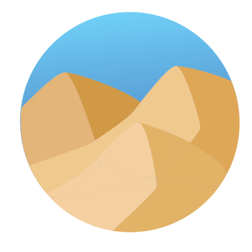

# Sahara.README

<!-- ## [Sahara Live!](https://sahara-62wu.onrender.com) -->

## What is Sahara?

Sahara is an Amazon clone!

## Functionality 

‘Sahara’ users will be able to:
* Browse products & look at a specific product
* Add Products/ Delete Products to/from the cart
* Change quantity of a product in their cart
* Search for a product by name
* Read & Create a Review
* Rate a product

## Technologies

* Javascript
* React
* Rails
* HTML
* CSS
* Semantic UI

## Accredit Assets 
Image assets were retrieved from: Amazon.com/ and @mimu.draws(sahara logo)

## Future Directions

In the future I would like to add the following:
* Darkmode toggle button
* Implement filter options for price
* Add categories
* Add checkout functionality for my cart
  + have order history
  + send an email after checkout for order confirmation
* Comb through the project and implement Semantic components for styling 

